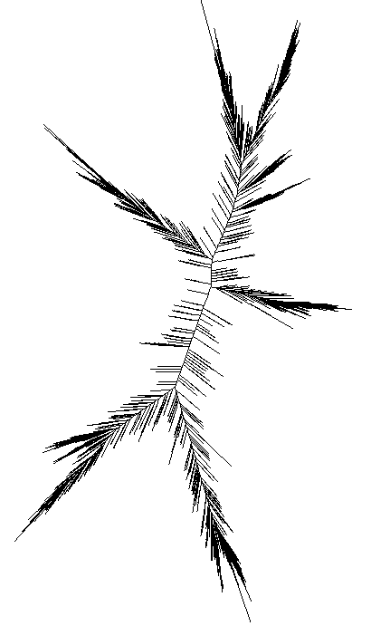

#  Ribosomal Operon Database (ROD)

This is the future home for the **Ribosomal Operon Database (ROD)**.  It is still in its early stages and there are bound to be some errors.  
The current release is ROD v1.0 - Golden Rod  
[](https://zenodo.org/doi/10.5281/zenodo.10948219)

### File description
There are three files associated with the database (all in different formats for convenience):
- _Genome Statistics_: These files 

  

  
---
## Updates 19.04.2023
- Updated to Version v1.0
## Updates 23.02.2023
- Plans for the next version (nicknamed **ROD Stewart**): update and clean some of the taxonomy and provide more statistics.
- We also have plans for testing different clustering strategies to see how real Operons when treated with common clustering approaches used in many metabarcoding studies. 
## Updates 13.02.2023 
### ROD v0.4
- **ROD** is born. 69k glorious whole operons sequence variants from 11k genomes in their full length! More stats coming...  
- Fasta and a Tibble in .rds format 
ba
---
### Old stuff
- *(Early February 2024)* The first version of the database has been uploaded [ROD v0.3](./ROD_v0.3.fasta.gz). For now, it is a fasta file with ribosomal sequences, and all the info is in the header. This version contains a set of **near**-full-length ribosomal operons. It contains 104k operons, representing 16k genomes fished from 35k downloaded from NCBI. The operons span at least 4000 bp. But some lack the beginning of 18S others the end of 28S (and sadly some lack both). 
-  The plan for the next release (nicknamed **v0.4 GoldenROD**) is to remove lacking the beginning or the end. 
The initial analysis of ROD seems to indicate that about 33% of the operons are missing portions in either '3 or '5. The updated number of full-length operons is 69K from 12K genome.
***

## Data 
The main source for data is the genome assemblies from NCBI, downloaded Medio 2023: 
```
# To download the meta data: 
rsync -t -v rsync://ftp.ncbi.nlm.nih.gov/genomes/ASSEMBLY_REPORTS/assembly_summary_genbank.txt .
```

Overview of genomes in NCBI as of Oct. 16 2023

```
##  See ftp://ftp.ncbi.nlm.nih.gov/genomes/README_assembly_summary.txt
## This is from column 25: 
  16538 archaea
1779617 bacteria
  16572 fungi
   6249 invertebrate
   7232 metagenomes
   7593 other (???)
   3604 plant
   1978 protozoa
   2854 vertebrate_mammalian
   3746 vertebrate_other
  80657 viral
```

***


--- 

"All the keywords in this explanation, by the way, are totally misleading due to the everyday quirks of language " - Don DeLillo, <i> Ratner's Star </i>