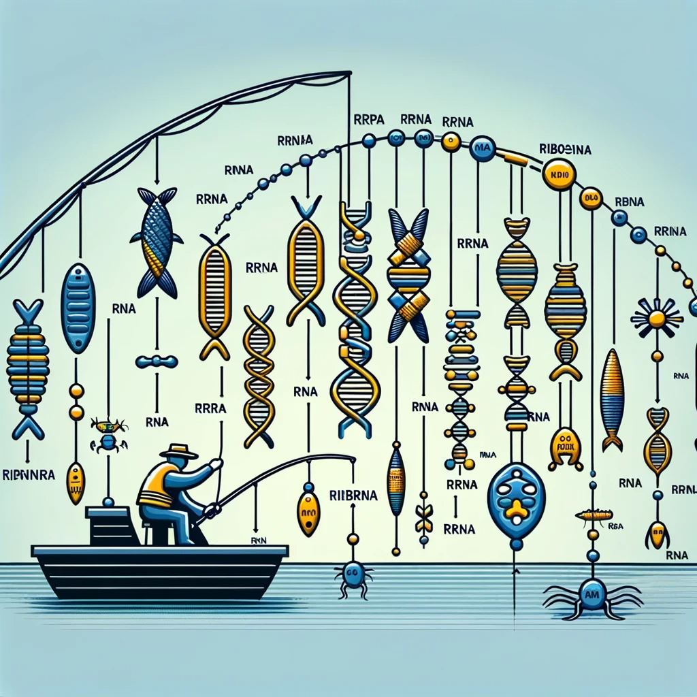

#  Ribosomal Operon Database (ROD)
This is the future home for the Ribosomal Operon Database (ROD).  

- I wonder where that fish has gone.
- You did love it so. You looked after it like a son.
- And it went wherever I did go.
- Is it in the cupboard?
- Yes! Yes! No!...
- Wouldn't you like to know? It was a lovely little fish.
- And it went wherever I did go.
- It's behind the sofa!
- Where can that fish be?
- Have you thought of the drawers in the bureau?!
- It is a most elusive fish!
- And it went wherever I did go.
- Ooooh, fishy, fishy, fishy fish!
- A-fish, a-fish, a-fish, a-fishy, ooooh.
- Ooooh, fishy, fishy, fishy fish!
- That went wherever I did go.
- Look up his trunk!
- Yeah, it's hidden in his trousers!
  
  
Oh fishy, fishy, fishy, fish
